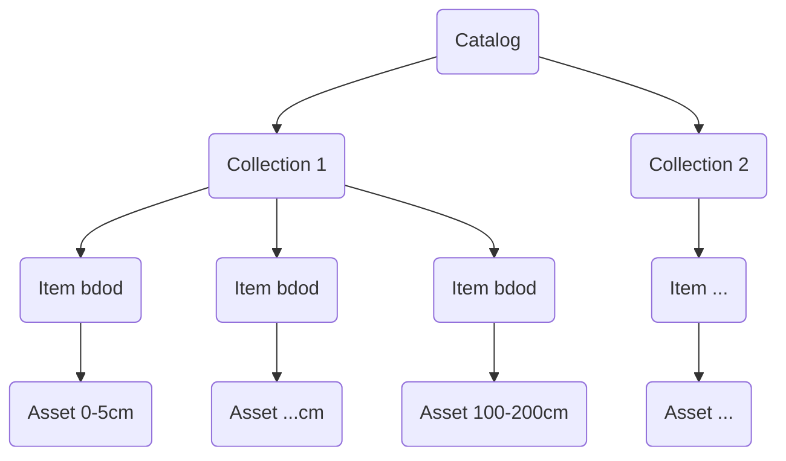
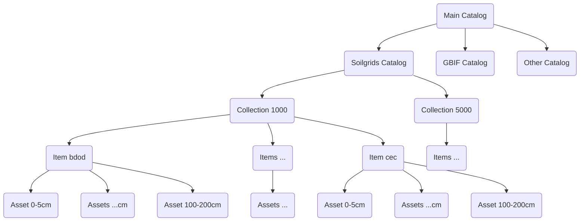

### Intro

Let's try another API, this time to convert a resource to a STAC-compatible resource usable by OpenEO.
Bunch of links:

- use openeo for discoverable datasources
- Soil grid (https://rest.isric.org/soilgrids/v2.0/docs) -> stac json -> openeo
- https://data.isric.org/geonetwork/srv/eng/catalog.search#/home (geonetwork instance)
- https://github.com/gantian127/soilgrids
- https://rest.isric.org/soilgrids/v2.0/docs
- https://docs.openeo.cloud/getting-started/client-side-processing/#background
- https://docs.openeo.cloud/getting-started/client-side-processing/#stac-collections-and-items
- https://github.com/Open-EO/openeo-community-examples/blob/main/python/LoadStac/load-stac-item-example.ipynb

### Setup

Use miniforge instead of conda from rocky linux repositories: https://github.com/conda-forge/miniforge
Setup to automatically initialize after installation. Once base env is active:

- create new env (setup with the latest python 3)

```bash
conda create --name openeo_api python=3
```

- activate env.

```bash
conda activate openeo_api
```

- install openeo

```bash
conda install conda-forge::openeo
```

- install soilgrids (optional if using direct links to data repository)

```bash
conda install conda-forge::soilgrids
```

- install pystac, shapely, jsonschema, rasterio 

```bash
conda install conda-forge::pystac
conda install conda-forge::shapely
conda install conda-forge::jsonschema
conda install conda-forge::rasterio
# optional
conda install conda-forge::stac-validator
```

### geotiff -> stac

Use

- tutorial: https://stacspec.org/en/tutorials/2-create-stac-catalog-python/
- data: 
  - https://data.isric.org/geonetwork/srv/eng/catalog.search#/metadata/b5ca4bb7-7846-48d9-9af9-a0a4a0b94f23
  - https://files.isric.org/soilgrids/latest/data_aggregated/5000m/bdod/

```bash
python -m src.test_basic \ 
  -c "Soilgrids_collection" \ 
  -d "1905-04-01" \ 
  -s "1905-04-01" \ 
  -e "2016-07-05" \ 
  -p "EPSG:4326" \ 
  -t "SoilGrids250m 2.0 - Bulk density aggregated 5000m" \ 
  -i "data/input/soilgrids/highres/bdod" \ 
  -o "data/output/soilgrids/test_catalog/"
```

### Hierarchy

How to structure the catalog, see https://eo-college.org/topics/the-stac-catalog/

One collection per Soilgrids dataset:



One asset per file (depth), one item per variable:



### best practice

see https://github.com/radiantearth/stac-spec/blob/master/best-practices.md
