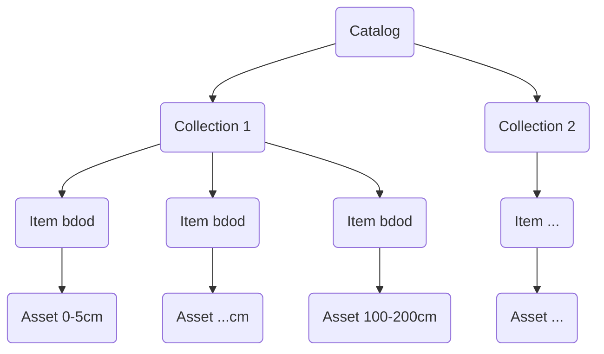
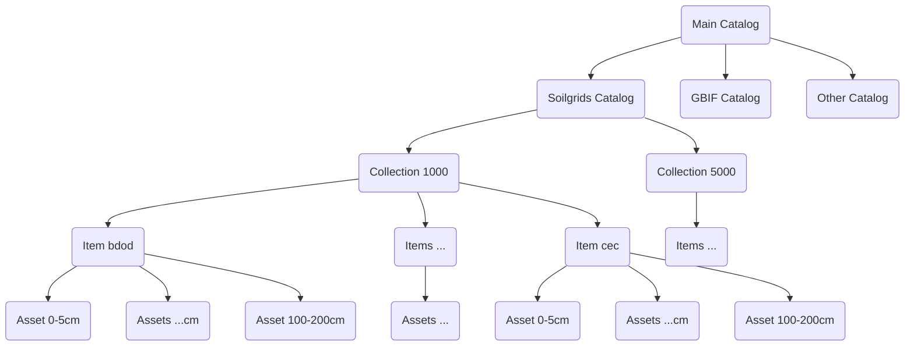

### Intro

Let's try another API, this time to convert a resource to a STAC-compatible resource usable by OpenEO.
Bunch of links:

- use openeo for discoverable datasources
- Soil grid (https://rest.isric.org/soilgrids/v2.0/docs) -> stac json -> openeo
- https://data.isric.org/geonetwork/srv/eng/catalog.search#/home (geonetwork instance)
- https://github.com/gantian127/soilgrids
- https://rest.isric.org/soilgrids/v2.0/docs
- https://docs.openeo.cloud/getting-started/client-side-processing/#background
- https://docs.openeo.cloud/getting-started/client-side-processing/#stac-collections-and-items
- https://github.com/Open-EO/openeo-community-examples/blob/main/python/LoadStac/load-stac-item-example.ipynb

### Setup

Use miniforge instead of conda from rocky linux repositories: https://github.com/conda-forge/miniforge
Setup to automatically initialize after installation. Once base env is active:

- create new env (setup with the latest python 3)

```bash
conda create --name openeo_api python=3
```

- activate env.

```bash
conda activate openeo_api
```

- install openeo

```bash
conda install conda-forge::openeo
```

- install soilgrids (optional if using direct links to data repository)

```bash
conda install conda-forge::soilgrids
```

- install pystac, shapely, jsonschema, rasterio 

```bash
conda install conda-forge::pystac
conda install conda-forge::shapely
conda install conda-forge::jsonschema
conda install conda-forge::rasterio
# optional
conda install conda-forge::stac-validator
```

### geotiff -> stac

Use

- tutorial: https://stacspec.org/en/tutorials/2-create-stac-catalog-python/
- data: 
  - https://data.isric.org/geonetwork/srv/eng/catalog.search#/metadata/b5ca4bb7-7846-48d9-9af9-a0a4a0b94f23
  - https://files.isric.org/soilgrids/latest/data_aggregated/5000m/bdod/

```bash
python -m src.test_basic \ 
  -c "Soilgrids_collection" \ 
  -d "1905-04-01" \ 
  -s "1905-04-01" \ 
  -e "2016-07-05" \ 
  -p "EPSG:4326" \ 
  -t "SoilGrids250m 2.0 - Bulk density aggregated 5000m" \ 
  -i "data/input/soilgrids/highres/bdod" \ 
  -o "data/output/soilgrids/test_catalog/"
  
# simpler version for multiple assets per item
python -m src.test_multiple_assets \ 
  -d "1905-04-01" \ 
  -s "1905-04-01" \ 
  -e "2016-07-05" \  
  -o "data/output/soilgrids/test_nested_catalog/"
```

### Hierarchy

How to structure the catalog, see https://eo-college.org/topics/the-stac-catalog/

One collection per Soilgrids dataset:



One asset per file (depth), one item per variable:



### best practice

see https://github.com/radiantearth/stac-spec/blob/master/best-practices.md

### Create a collection

```bash
curl -X POST <SERVER>/collections -H 'Content-Type: application/json' -d '<json>'
```

where <SERVER> is : https://bmd-stac.dryrun.link
where <json> is the payload, contains the API key, and is :

```json
{
  "type": "Collection",
  "id": "soilgrids_collection_1000m",
  "stac_version": "1.1.0",
  "stac_extensions": [
    "https://stac-extensions.github.io/datacube/v2.2.0/schema.json",
    "https://stac-extensions.github.io/authentication/v1.1.0/schema.json"
  ],
  "title": "Soilgrids collection at 1000m",
  "description": "this a soilgrids collection at a specific resolution (1000m)",
  "auth:refs": "fb0f7505337ed43a81971d9c",
  "extent": {
    "spatial": {
      "bbox": [
        [
          -179.77911370816287,
          -55.98232503302354,
          179.56061669726006,
          82.71928405344526
        ]
      ]
    },
    "temporal": {
      "interval": [
        [
          "1905-04-01T00:00:00Z",
          "2016-07-05T00:00:00Z"
        ]
      ]
    }
  },
  "license": "CC BY 4.0",
  "keywords": [
    "soilgrids",
    "aggregated",
    "1000",
    "bdod",
    "cec",
    "cfvo",
    "clay",
    "nitrogen",
    "ocd",
    "ocs",
    "phh2o",
    "sand",
    "silt",
    "soc",
    "wv0010",
    "wv0033",
    "wv1500"
  ]
}
```

## Create an item for a collection

```bash
curl -X POST <SERVER>/collections/<collection_id>/items -H 'Content-Type: application/json' -d '<json>'
```

```json
{
  "type": "Feature",
  "stac_version": "1.1.0",
  "stac_extensions": [
    "https://stac-extensions.github.io/eo/v1.1.0/schema.json",
    "https://stac-extensions.github.io/authentication/v1.1.0/schema.json"
  ],
  "auth:refs": "fb0f7505337ed43a81971d9c",
  "id": "item_bdod_1000m",
  "geometry": {
    "type": "Polygon",
    "coordinates": [
      [
        [
          -179.77911370816287,
          -55.982325033023535
        ],
        [
          -179.77911370816287,
          82.71928405344526
        ],
        [
          179.56061669726006,
          82.71928405344526
        ],
        [
          179.56061669726006,
          -55.982325033023535
        ],
        [
          -179.77911370816287,
          -55.982325033023535
        ]
      ]
    ]
  },
  "bbox": [
    -179.77911370816287,
    -55.982325033023535,
    179.56061669726006,
    82.71928405344526
  ],
  "properties": {
    "start_datetime": "1905-04-01T00:00:00Z",
    "end_datetime": "2016-07-05T00:00:00Z",
    "datetime": "1905-04-01T00:00:00Z"
  },
  "assets": {
    "bdod_0-5cm_mean_1000": {
      "href": "https://files.isric.org/soilgrids/latest/data_aggregated/1000m/bdod/bdod_0-5cm_mean_1000.tif",
      "type": "image/tiff; application=geotiff",
      "title": "bdod_0-5cm_mean_1000",
      "eo:bands": [
        {
          "name": "0-5cm",
          "description": "0-5cm"
        }
      ]
    },
    "bdod_5-15cm_mean_1000": {
      "href": "https://files.isric.org/soilgrids/latest/data_aggregated/1000m/bdod/bdod_5-15cm_mean_1000.tif",
      "type": "image/tiff; application=geotiff",
      "title": "bdod_5-15cm_mean_1000",
      "eo:bands": [
        {
          "name": "5-15cm",
          "description": "5-15cm"
        }
      ]
    },
    "bdod_15-30cm_mean_1000": {
      "href": "https://files.isric.org/soilgrids/latest/data_aggregated/1000m/bdod/bdod_15-30cm_mean_1000.tif",
      "type": "image/tiff; application=geotiff",
      "title": "bdod_15-30cm_mean_1000",
      "eo:bands": [
        {
          "name": "15-30cm",
          "description": "15-30cm"
        }
      ]
    },
    "bdod_30-60cm_mean_1000": {
      "href": "https://files.isric.org/soilgrids/latest/data_aggregated/1000m/bdod/bdod_30-60cm_mean_1000.tif",
      "type": "image/tiff; application=geotiff",
      "title": "bdod_30-60cm_mean_1000",
      "eo:bands": [
        {
          "name": "30-60cm",
          "description": "30-60cm"
        }
      ]
    },
    "bdod_60-100cm_mean_1000": {
      "href": "https://files.isric.org/soilgrids/latest/data_aggregated/1000m/bdod/bdod_60-100cm_mean_1000.tif",
      "type": "image/tiff; application=geotiff",
      "title": "bdod_60-100cm_mean_1000",
      "eo:bands": [
        {
          "name": "60-100cm",
          "description": "60-100cm"
        }
      ]
    },
    "bdod_100-200cm_mean_1000": {
      "href": "https://files.isric.org/soilgrids/latest/data_aggregated/1000m/bdod/bdod_100-200cm_mean_1000.tif",
      "type": "image/tiff; application=geotiff",
      "title": "bdod_100-200cm_mean_1000",
      "eo:bands": [
        {
          "name": "100-200cm",
          "description": "100-200cm"
        }
      ]
    }
  },
  "collection": "soilgrids_collection_1000m"
}
```